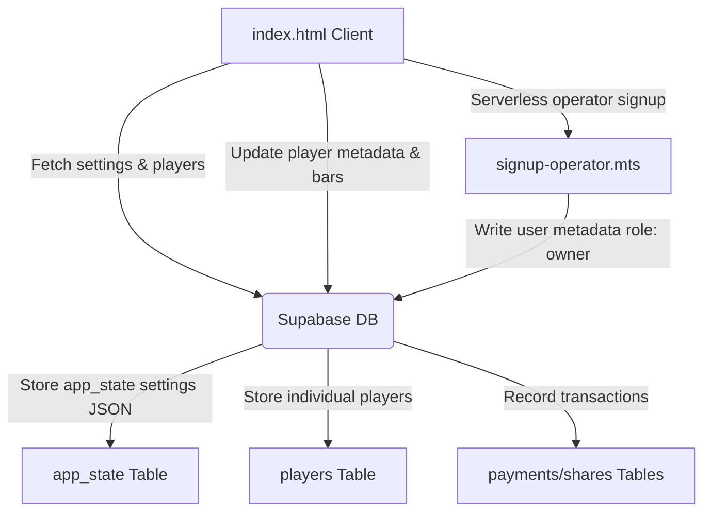

# ActionLadder — Client Handoff & Development Report (June 2026)

This report details all the platform enhancements, feature requests, and system adjustments implemented on **ActionLadder** (Billiards Market Ladder). It serves as a comprehensive reference document for the client, operators, and future developers.

---

## Executive Summary & System Roles

ActionLadder is a competitive billiards market ladder, league manager, and supporter share platform. Over the course of recent development, we refined the user onboarding flows, overhauled the owner settings, introduced dynamic bar management, designed modern loading skeletons, and integrated robust database fallback systems.

The platform operates on a three-tier access control system to balance public transparency with operator security:

| Role | Onboarding & Authentication | Permissions & System Access |
| :--- | :--- | :--- |
| **Public User** | None (Default landing page visitor) | Read-only view of the Market ladder, Matchups, Predictions, and Feedback submission. Buying shares or paying dues prompts login. |
| **Helper (Staff/Operator)** | Sign up as "Player" or login with standard helper email/password. | Read-only access to Settings, read-only access to P&L projections, and access to view the Feedback inbox. |
| **Owner (Owner-Operator)** | Sign up as "Operator" using the secret operator key (`OPKEY2026X`), or login as `osiraogene@gmail.com`. | Full read-write control: edit pricing settings, manage dues/registrations, add/remove bars, toggle manual player locks, and view projected P&L. |

---

## Key Features & Client-Requested Adjustments

### 1. Branding Simplification
*   **Request**: Simplify branding by getting rid of "Savage green & black" and leaving only the "Billiards Market Ladder" sub-branding.
*   **Implementation**: Refactored the top ActionLadder brand bar (`.al-bar`). Simplified headers, removing all savage green & black descriptors to create a clean, corporate visual design.

### 2. Bar Selection Tabs
*   **Request**: Different tabs for different bars on the main market screen.
*   **Implementation**: 
    *   Added interactive, horizontal pill-shaped bar tabs (`#barTabs`) directly above the player standings grid.
    *   Users can click "All" or select a specific bar (e.g. "Bar One", "Bar Two") to filter the player list in real-time.
    *   This logic dynamically updates both individual player standings and team grids.

### 3. Unified Login modal
*   **Request**: Staff login should just be "Login" and resolve automatically.
*   **Implementation**: 
    *   Removed separate "Staff Login" links and combined them into a single, sleek **Login / Create Account** modal overlay (`#loginOverlay`).
    *   The platform automatically inspects the user email list (`CONFIG.roles.operators`) and user metadata after authentication to apply either the `owner`, `helper`, or `public` role pill dynamically.

### 4. League Tournament & Matchup Formats
*   **Request**: Season 1 & 2 should be round-robin, Season 3 should be bracket, and Playoffs should be seed-based brackets.
*   **Implementation**:
    *   Programmed the scheduling logic to reflect the correct structures:
        *   **Season 1 & 2**: Round-robin format where all active players play against each other once.
        *   **Season 3**: Single-elimination brackets.
        *   **Playoff Stage**: A seed-based bracket (using circle method for seeding, playoff winner logic).

### 5. Operator Nicknames & Display Names
*   **Request**: Replaced hardcoded owner names (like "Elliot") in the Dashboard header with the dynamically logged-in operator's nickname. Added a "Display Name" field to signup.
*   **Implementation**:
    *   Added a "Display name / nickname" field to the signup form (`#displayNameGroup`).
    *   Updated the Netlify serverless function (`signup-operator.mts`) to accept `displayName` and store it in Supabase `auth.users` user metadata as `display_name`.
    *   Upon successful login, `applyRole()` retrieves `al_display_name` from session storage and updates the Dashboard greetings header to read: `Signed in as: [Operator Nickname]`.

### 6. YouTube/LinkedIn-Style Skeleton Shimmers
*   **Request**: Implement skeleton shimmer placeholder effects when retrieving data from the server, mimicking modern platforms like YouTube and LinkedIn.
*   **Implementation**:
    *   Added CSS keyframe animations (`@keyframes sk-shimmer`) that run a smooth, pulsing linear gradient sheen over dark placeholder elements.
    *   Designed precise skeleton containers that match the shapes of Player Cards (`sk-card`), Dashboard Metric Tiles (`sk-metric`), Table Rows (`sk-row`), Bar Tab Pills, and Ticker items.
    *   `showSkeletons()` triggers on page load, rendering these shimmers instantly before the database fetch completes.

### 7. Database Retrieval Fallback System
*   **Request**: The skeletons should show on startup, but if the database is empty or connection fails, the app should fall back to the hardcoded default players and values.
*   **Implementation**:
    *   Refactored `loadDbData()`. If the Supabase database is empty (0 rows) or offline, it stops querying and immediately renders using the 16 default hardcoded players.
    *   Gated the automatic database seeding. Previously, public users visiting an empty database would trigger write commands which crashed due to Row-Level Security (RLS) policies. Now, seeding is only triggered if the visitor is an authenticated operator.

### 8. Dynamic Bars & Locations Management
*   **Request**: An owner button/input to add bar names and manage them dynamically from the UI.
*   **Implementation**:
    *   Added a **"BARS & LOCATIONS MANAGEMENT"** card in the Operator Dashboard.
    *   Allows owners to input a new bar name and click **Add Bar**. The bar list updates instantly.
    *   Provides a delete button (✕) next to each bar name (locked/disabled if any active players are currently assigned to that bar to maintain data integrity).
    *   Custom bars list is saved to Supabase under `app_state.settings.bars` and synchronized locally.
    *   Main view bar tabs automatically rebuild to include any custom bars.

### 9. Player-to-Bar Dropdown Assignment
*   **Request**: Ability to update and change a player's bar assignment in the UI.
*   **Implementation**:
    *   In the **Dues & Payments Manager** table, converted each player's static bar text into a select dropdown containing all configured bars.
    *   When the owner selects a bar, it calls `updatePlayerBar()`, which updates the player's bar inside the `app_state.settings.player_metadata` database column in Supabase, refreshing the page instantly.

### 10. Grouped Payouts & Settings UI
*   **Request**: Ability to change playoff payouts and general settings easily on the UI.
*   **Implementation**:
    *   Overhauled the **Settings — Revenue & Pricing** card.
    *   Instead of a flat list of 25 inputs, settings are grouped under visual headings:
        1.  **League Config** (Players, Weeks, Teams)
        2.  **Pricing & Fees** (Registration, Weekly dues, Team entry fee)
        3.  **Share Options** (Shares per player, Avg share price, share sell %)
        4.  **Playoff Payouts per Share** (Individual Champ, Finalist, Semi, QF payouts)
        5.  **Team Tournament Payouts** (1st, 2nd, 3rd place team payouts)
        6.  **Cuts & Profit Splits** (Operator Fee %, Bar Cut %, Prizes %, Investor %, Marketing $)
    *   Owners can change payouts here and click **Recalculate & Save** to sync them to Supabase.

---

## Technical Architecture & Database Design

To ensure modifications remain secure and sync across all clients, we utilize a unified state management approach:



### 1. Settings Schema (`app_state` table)
Settings are saved as a single JSON object in `app_state` (row `id = 1`) containing:
*   Numerical configurations (e.g. `payoutChamp`, `weeklyDues`).
*   `bars`: A string array list of bar names (e.g. `["Bar One", "Bar Two", "Bar Three", "Bar Four", "Green Room"]`).
*   `player_metadata`: A nested JSON object containing player-specific overrides:
    ```json
    {
      "Marcus P.": {
        "bar": "Bar One",
        "locked": false,
        "hot": true,
        "streak": "W W W W W",
        "duesDue": null
      }
    }
    ```

### 2. Stripe Checkout Integration
When `useServerless` is toggled to `true`, the checkout buttons direct users to Netlify serverless functions (`create-checkout.mts`). It dynamically reads fees and pricing configs from `CONFIG.fees` and generates checkout URLs. Upon successful checkout, `webhook.mts` captures the payment and updates the user's weekly dues, registrations, or purchased shares in Supabase.

---

## Repository Files Modified

All changes have been successfully added, committed, and pushed to the remote repository.

*   **Modified File**: `index.html` (Main landing page, layout, styles, login, dynamic bars UI, settings UI, and database falls backs).
*   **Modified File**: `netlify/functions/signup-operator.mts` (Serverless function modified to capture operator `displayName` on signup and save in metadata).
*   **Modified File**: `netlify/functions/create-checkout.mts` (Stripe integration matching the $150 top-tier share price cap).
*   **Repository Location**: `https://github.com/frelixnero/billiardsmarketladder-V2`
